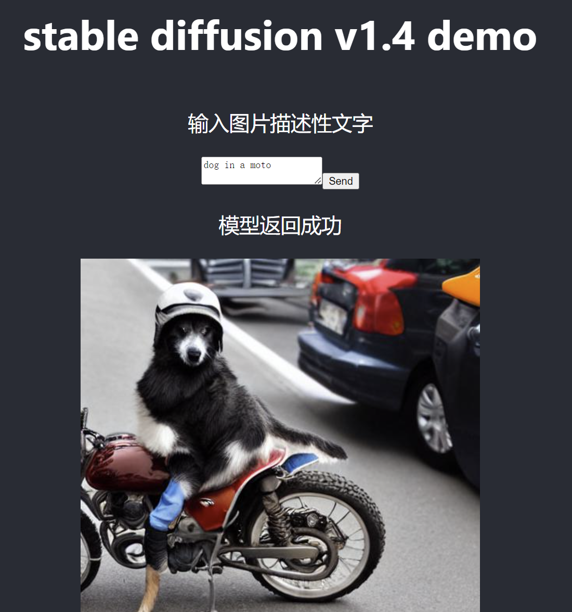

# 使用说明（重要！）

### step1: docker打包镜像--sddemo
    docker build -t sddemo .

### step2: 运行gpu镜像--sddemo
    docker run --gpus all -it -p 3000:3000  sddemo

### step3: 登录终端启动服务（开两个窗口）（手动）
    cd /sd_demo/back_flask
    flask --app app run

    注：第一次启动服务需要下载模型，约5G左右,有报错，重新执行上述命令即可。

    后端启动成功后，新开窗口启动react
    cd /sd_demo/front_react
    npm start

注：react端口：3000；flask端口：5000

# 界面UI

# 文件结构
    前端：front_react
        reactjs开发交互UI，通过api.js访问后端服务
    后端：back_flask
        基于python的web框架-flask，直接调用hugging face提供的pytorch模型。

# 其他命令

### 挂载文件开发（测试使用）
    docker run -p 3000:3000 `
        --gpus all -it `
        -w /sd_demo --mount type=bind,src="$(pwd)",target=/sd_demo `
        sddemo

    